# Лабораторная работа №6

## 1. Цель работы

Изучение базовых возможностей системы управления версиями, опыт работы с Git Api, опыт работы с локальным и удаленным репозиторием.

## 2. Основная часть работы

### Форк репозитория

Создается копия репозитория в личное хранилище, копируются обе ветки: master и branch1

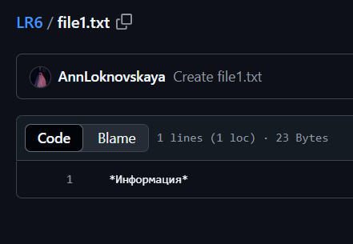

### Настройка клиента git

Задается имя пользователя согласно требованиям, указанным в ЛР. Почта уже была задана ранее. 

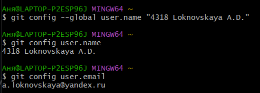

### Клонирование репозитория на компьютер

Создается папка, в которую будет клонирован репозиторий. 

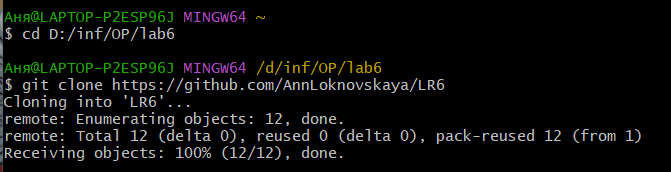

### Добавление файла через интерфейс GitHub

В личном репозитории необходимо воспользоваться кнопкой ```add file``` >> ```create new file```. В основкую ветку был добавлен текстовый файл ```file.txt```.


### Подтягивание изменений в локальный репозиторий

Подтягиваем добавление нового файла в репозиторий на компьютере.

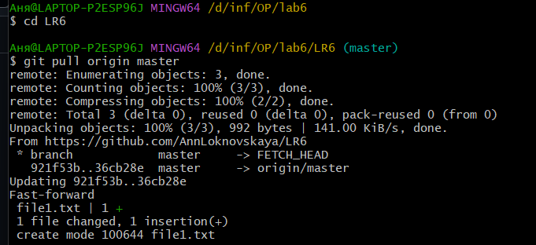

### История операций для каждой ветки

Для начала просматривается история для основной ветки, затем происхолдит переключение на branch1 и просмотр ее истории.

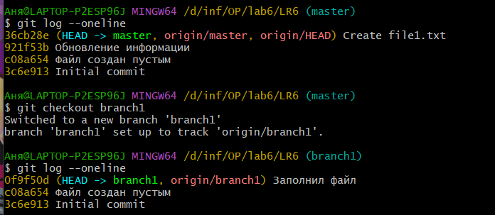

### Просмотр последних изменений

Просмотр последнего коммита выполняется для веток в обратном порядке аналогично предыдущему шагу - сначала для branch1, затем для master.

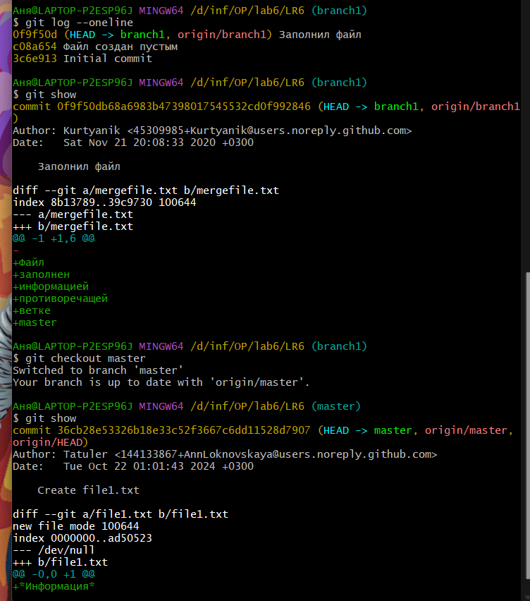

### Слиние в одну ветку

Изначальная попытка слить ветки не увенчивается успехом, возник конфликт веток. В индекс не былы добавлены изменения файла mergefile.txt. Необходимо добавить изменения в основную ветку, после чего повторно применить команду слияния.

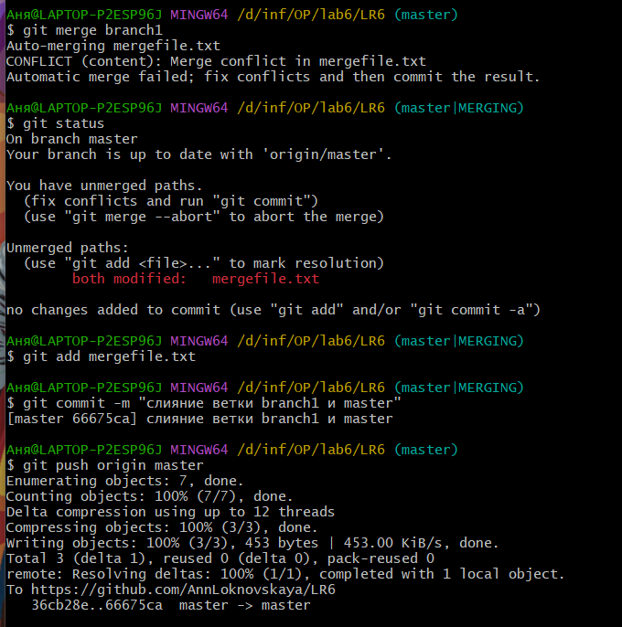

### Удаление побочной ветки

После слияния двух веток, ветка branch1 удаляется.


### Изменения в файле

Файл ```file.txt``` был изменен несколько раз, изменения были зафиксировны коммитами.

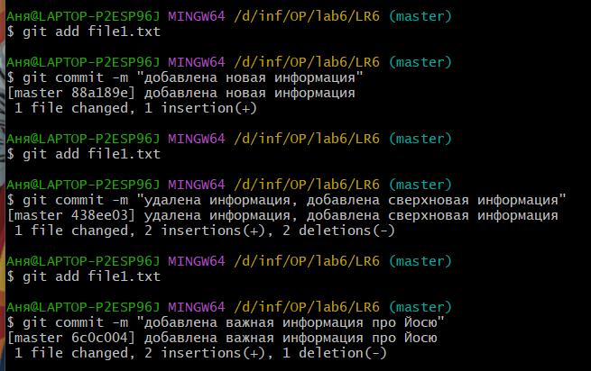

### Откат коммита

Для отката необходимо указать хеш того коммита, на который произойдет откат. Все изменения, сделанные после этого коммита будут отменены.

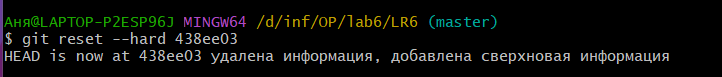

### Создание ветки для отчета

Для отчета и демонстрации проделанной работы создается новая ветка ```report_branch```.

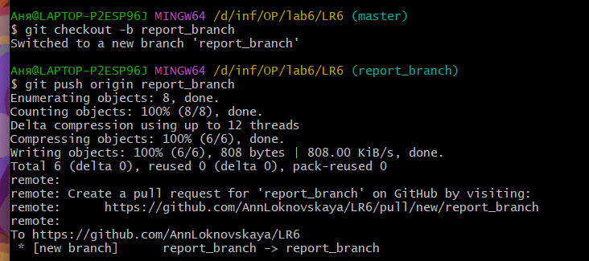

## 3. Логи команд

В процессе выполнения лабораторной работы были использованы следующие команды:

```
git config --global user.name "4318 Loknovskaya A.D."
git cofig user.name
git config user.email
git clone https://github.com/AnnLoknovskaya/LR6
git pull origin master
git log --oneline
git checkout branch1
git checkout master
git show
git merge branch1
git status
git add ...
git commit -m "comment"
git push origin --delete branch1
git reset --hard 438ee03
git checkout -b report_branch
git push origin ...
```

## 4. История операций в форматированном виде
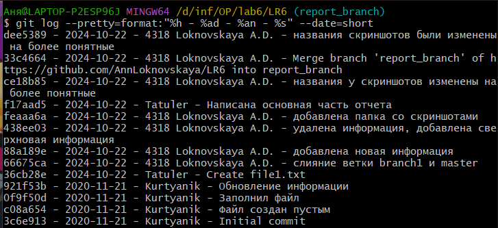

## 5. Выводы

В ходе выполнения лабораторной работы были изучены базовые возможности системы управления версиями, получен опыт работы с Git Api, получен опыт работы с локальным и удаленным репозиторием.


